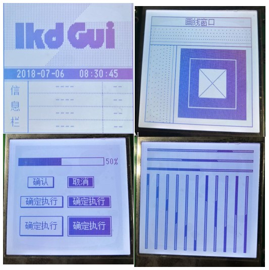
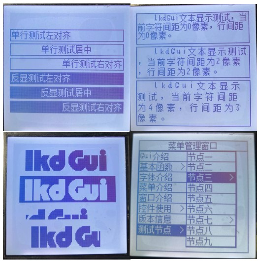

# lkdGui使用文档

`lkdGui`是一款为`单色显示屏`制作的图形化界面，lkdGui主要定位于工业控制领域，用于简单漂亮的图形界面设计。它的源代码全部使用c语言编写，符合c99标准。它包含了常用的画图函数如画点、画线、画矩形、文字显示、按钮控件、进度条控件。它使用`窗口`进行统一管理和调度，使得各个应用显示模块之间低耦合，方便应用程序的开发。

## lkdGui源码介绍

1. `lkdGui_source`文件夹:它包含了lkdGui的所有源码
    1. `include`文件夹:它包含了Gui所有的`.h`文件。移植时应将此路径加入工程项目。
        1. `lkdGui.h`:此文件里包含所有的Gui函数接口。用户使用Gui函数时应该包含此头文件。
        1. `lkdGuiConfig.h`:此文件用来配置和裁剪Gui.
        1. `lkdGuiTypedef.h`:此文件定义了Gui相关的数据结构，使用者不必看它。
    1. `port`文件夹:它里边包含的是移植相关的文件。
        1. `fontDriver`文件夹:它包含常用的字模库、字库芯片驱动等。使用者可以在这里面加入字体相关的驱动。
        1. `lcdDriverPort`文件夹:它包含常用的液晶驱动。使用者可以在这里面加入液晶相关的驱动。
        1. `lcdDriverPort.c`:Gui的液晶驱动移植接口。用户应该填充里面的相关函数。
        1. `userFontPort.c`:Gui的字体驱动移植接口。用户应该填充里面的相关函数。
        1. `userAppPort.c`:这个输入应用层,里面包含了初始化、窗口管理等函数。永和可以直接在这里面写应用。
    1. `source`文件夹:Gui绘图、窗口管理等相关函数实现源码。

## lkdGui移植

上节的源码介绍中已经提到了移植相关的工作在`port`文件夹中。分为字体移植接口和液晶移植接口。
1. 字体移植接口:包含`fontDriver`文件夹和`userFontPort.c`。移植流程如下:
    1. 用户先看`fontDriver`文件夹下有没有自己要用的字体库或字库芯片驱动。如果没有则需要添加。
    1. 然后修改`userFontPort.c`。填充此文件中的相关函数。
        1. GetDfontData():此函数用于获取汉字字模。字体库中应该包含获取字模的函数.用此函数调用即可。
        1. GetSfontData():此函数用于获取ASII码字模。使用如GetDfontData()。
        1. 用`lkdFont`结构体对象声明自己的字体->初始化->用GuiFontSet()设置为系统默认字体。
1. 液晶移植接口:包含`lcdDriverPort`文件夹和`lcdDriverPort.c`。移植流程如下:
    1. 用户先看`lcdDriverPort`文件夹下有没有自己要用的液晶驱动。如果没有则需要添加。
    1. 然后修改`lcdDriverPort.c`。填充此文件中的相关函数。(根据需求可以只填部分函数)。下面是必须要填充的。
        1. GuiUpdateDisplayAll():此函数用于将缓存的数据刷新到液晶。
        1. GuiDrawPoint():画点函数。在液晶固定位置画点。
1. 修改`lkdGuiConfig.h`中液晶大小相关宏。`GUI_LCM_XMAX`,`GUI_LCM_YMAX`.
1. 用户使用接口:用户可使用的接口函数都包含在`lkdGui.h`中。`userAppPort.c`是用户使用的模板。

## lkdGui窗口介绍

lkdGui使用窗口作为管理、调度单元。用户所有的绘图都应该在具体的某个窗口里边。
1. `lkdGuiConfig.h`中的`GUIWINMANAGE_NUM`用于修改窗口最大嵌套数量。
1. `GuiWinInit()`系统上电时应该使用它初始化窗口相关资源。
1. `GuiWinDisplay()`是窗口调度函数,需要程序一直能执行到。
1. `lkdWin`是窗口的结构体。用户使用它创建任意多个窗口实体对象。lkdWin->WindowFunction()是用户在此窗口里画图等的接口。
1. `GuiWinAdd()`函数用于将`lkdWin`结构的窗口实体对象加入到窗口调度栈中。
1. `GuiWinDeleteTop()`函数用于将顶部的窗口实体对象从窗口调度栈中移除。
1. `GuiGetTopWin()`函数可以获取窗口调度栈中顶部的窗口(当前显示的窗口)。

## lkdGui菜单介绍

菜单是lkdGui里一个有特色的控件,而且在工业控制中经常使用。具体使用请参看例程。

## lkdGui字体介绍

lkdGui可以添加很多字体库，在使用过程中使用`GuiFontSet()`函数来切换。使用GetCurrentFont()函数可以获取当前的字体指针;

## 其他控件和绘图函数

见`lkdGui.h`。里面有详细的使用说明。

## lkdGui简单显示演示

1.lkdGui演示视频:[lkdGui演示视频链接](https://v.youku.com/v_show/id_XMzcxMTY3NjUyMA==.html)

2.相关图片

## lkdGui源码获取

1. <https://github.com/guoweilkd/lkdGui.git>
1. <//download.csdn.net/download/qq_23274715/12243571>

## 关于技术交流
此处后的文字已经和题目内容无关，可以不看。
qq群:825695030
微信公众号:嵌入式的日常
如果上面的文章对你有用，欢迎打赏、点赞、评论。
